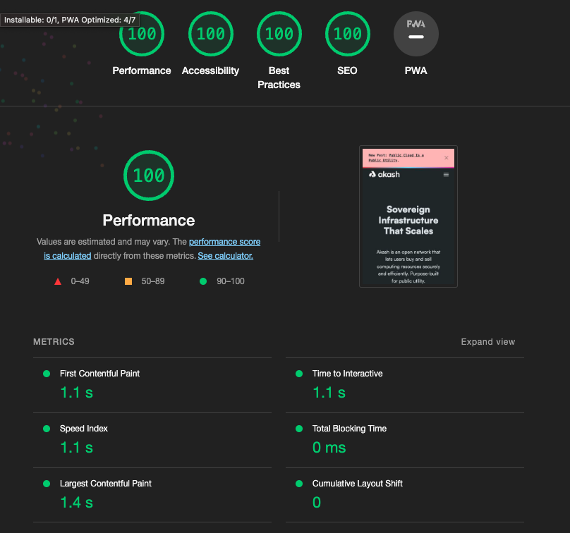

<p align="center">
  
</p>

# Akash Network Website

This repository contains the source code for the [Akash Network website](akash.network).

## Development

### Clone the repository

Clone the repository using git to your local machine.

```sh
git clone https://github.com/akash-network/website.git
```

### Pull Submodules

The repo uses git submodules, pull the latest changes from the community repo.

```sh
git submodule update --init --recursive
```

Optionally, for existing repositories, you can pull the latest changes from the community repo using the following command.

```sh
git submodule update --remote
```

### Install Dependencies

Install the dependencies using npm.

```sh
npm install

```
### Run the development server

```sh
npm run server
```

## Generating Community Pages

```sh
npm run import:community
```

### Changelog

Changelog is automatically generated from commit messages. Please follow [Conventional Commits](https://www.conventionalcommits.org/en/v1.0.0/) when writing commit messages. See this [post](https://mokkapps.de/blog/how-to-automatically-generate-a-helpful-changelog-from-your-git-commit-messages/) for more information.

### Releasing

```sh
$ npm run release

# minor release
$ npm run release:minor

# patch release
$ npm run release:patch

# major release
$ npm run release:major
```

### Design

For all design contributions please visit our [guidelines](https://github.com/aktdenis/website/blob/main/design-contribution-guidelines)

### Audits

Please run Google Lighthouse and SEO audits before submitting a PR. The v1.0.0 release [scores](https://googlechrome.github.io/lighthouse/viewer/?gist=d40d3178592c72ddc6b8acb794b3e434) are as follows:




##

### Roadmap

- **Homepage**
  - [x] Write draft copy for benefits and features
  - [x] Add "latest from the blog"
  - [x] Add copyright in the footer
  - [x] Design homepage
  - [x] Implement 1st draft of homepage design
  - [x] Add subscribe to newsletter
  - [ ] Add Privacy page
  - [x] Link Get Started to Docs
  - [x] Social Media Preview
  - [-] Add connect with community
  - [ ] (Stretch) Add Case studies preview
- **Blog**
  - [x] Render images in related blog posts
  - [x] Fetch Author from DatoCMS
  - [x] Fetch Tags and Categories from DatoCMS
  - [ ] Add By Year Filter for Blog
  - [ ] Import Images from DatoCMS
- **Community**
  - [x] Implement: Text Community Page
  - [ ] Add News Section
  - [ ] Add Contributors Section
- **Token**
  - [x] Add Token Metrics (Build time) on Token Page
- **Docs**
  - [ ] Replace tokenizer with text replace
  - [ ] Import all Docs
- **Misc**
  - [ ] (Stretch) Enable GoAT diagram support (migrate away from doks)
  - [ ] Enable Social Media preview
  - [ ] Conduct Performance Audit (Google Lighthouse) and implement recommendations
  - [ ] Conduct SEO Audit and implement recommendations
- **Ecosystem (Stretch)** 
  - [ ] Feature: Ecosystem Page
  - [ ] Add Case Studies
- Development Documentation
  - [ ] Add a "How to contribute" section to the README
  - [x] Add a "How to run the website locally" section to the README
