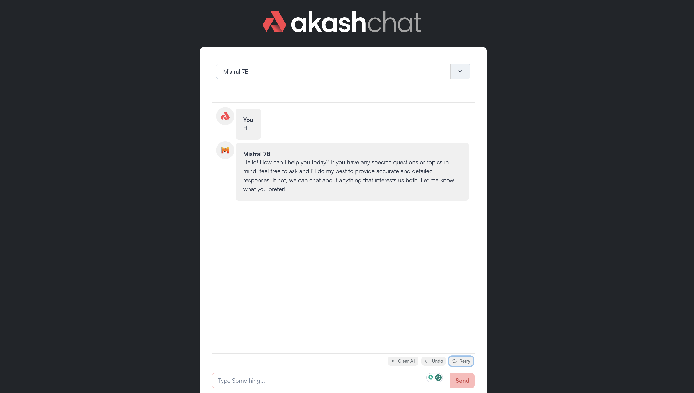
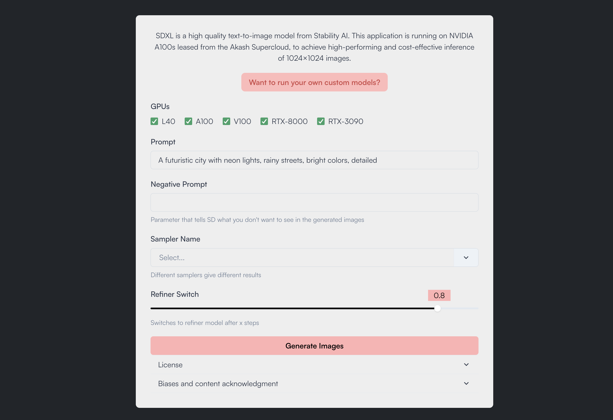
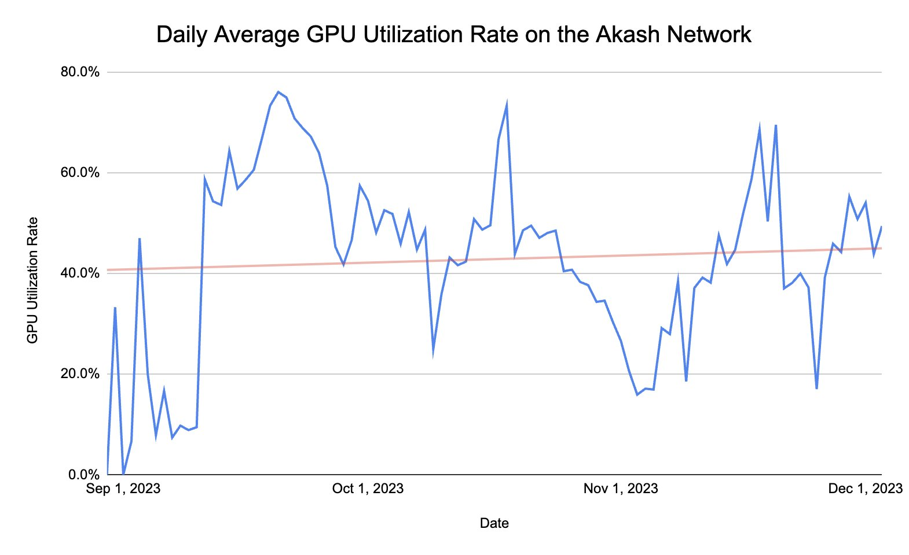

*How strategic progress in 2023 laid the foundation for rapid acceleration in 2024 and beyond.*

---

The shape of the next decade and beyond will be decided by access to compute. Anyone who is tapped into the emerging zeitgeist among those directly involved with, and those adjacent to, the technology industry can see this playing out in real-time. [People are forming into two nascent groups](https://www.bloomberg.com/news/newsletters/2023-12-06/effective-accelerationism-and-beff-jezos-form-new-tech-tribe). On one side, the remains of the now-largely-discredited Effective Altruism (EA) movement argue in favor of deceleration, or taking a cautious approach to technological progress. On the other, [techno-optimists](https://a16z.com/the-techno-optimist-manifesto/) and proponents of [Effective Accelerationism (e/acc)](https://en.wikipedia.org/wiki/Effective_accelerationism) advocate for [accelerating technological progress](https://www.nytimes.com/2023/12/10/technology/ai-acceleration.html).

Akash has always been positioned to support the rapid advancement of technology. Overclock Labs, the creators and most prominent contributors to Akash, believe that building permissionless tools that enable open-source access to the most powerful compute resources will only bolster a rising tide that ultimately improves all of society.

2023 was one of the most critical years in the history of Akash. Over the past year, the network passed several significant milestones that further cemented Akash’s place as the premier decentralized network for cloud compute — all built by a radically open community working in public.

## The key achievements of 2023
Two significant improvements led to network development in 2023. First, radically open-sourcing the entire Akash codebase (including core network deployment applications and the website) and creating an open framework for community contributions that closely resembles the structure of a [Decentralized Autonomous Organization (DAO)](https://en.wikipedia.org/wiki/Decentralized_autonomous_organization). Second, bolstering network capabilities by adding support for GPUs — starting with NVIDIA and recently expanding to include AMD models.

### Building a radically open community
In January 2023, [Akash radically opened up the process for developing the network](https://akash.network/blog/public-cloud-is-a-public-utility/) using a distributed community model that takes inspiration from [Kubernetes](https://kubernetes.io/) and the DAO structure to create an entirely new open organization optimized to the needs of the Akash community.

Special Interest Groups (SIGs) and Working Groups (WGs) form the backbone of Akash’s open community. These groups organize around specific objectives or deliverables and meet regularly in publicly broadcast meetings, with contributors completing work asynchronously around the world. The diagram above outlines the initial set of SIGs and WGs. Still, these groups are fluidly dynamic and change to fit the priorities of the Akash Community at any given time. Crucially, all these groups are overseen by the Steering Committee (SC), which is aware of all current projects and holds a monthly meeting to review the current project list and hear proposals for new projects and initiatives.

Over the past number of years, many DAOs have come and gone, most sharing a similar terminology, but most have yet to be able to remain organized and deliver tangible results over an extended period. This is due to many factors, but the primary cause of dysfunction is the need for clear organization and oversight to remain consistent and well-organized over time. Without clear leadership and guidance, contributor roles can become unclear, timelines aren’t created or met, and results often never appear. 

In contrast, Akash’s radically open system has already delivered on many of its promises after only one year of open operations. This year, the community will continue to publicly collaborate and look to expand the contributor base to deliver even more results — along with showcasing what is possible for a well-organized open community.

### Launching support for NVIDIA & AMD GPUs
In August of last year, Akash completed the [upgrade to Mainnet 6, which brought support for GPUs to the network](https://akash.network/blog/the-supercloud-for-ai-is-live/). Adding GPU support to Akash was vital to addressing the global GPU shortage, caused primarily by supply chain bottlenecks that limit the manufacturing and distribution of the most powerful GPUs mainly used for AI model training, fine-tuning, and inference.

When GPU support was launched, plans were laid out for the future inclusion of other chip manufacturers, such as AMD (and support for these chips was added in late 2023). This upgrade made NVIDIA H100s and A100s, along with a wide range of consumer-grade GPUs, accessible on the network, positioning Akash as one of the leading networks to access the broadest range of compute flexibly.

Akash serves the market for permissionless compute by focusing primarily on two segments of the GPU supply. The first segment includes high-performance chips that are often difficult to access (given the GPU shortage) but are the most performant for AI training, fine-tuning, and inference. The second segment includes consumer-grade chips which represent a massive supply of underutilized compute. These could GPUs are often repurposed from former crypto mining operations, and also from individual builders and those who have built personal computers with these chips. Akash enables both of these segments to bring this underutilized compute to market on an open and permissionless network that gives the hardware owner significant flexibility and control.

The proliferation of Large Language Models (LLMs) and AI applications triggered an unprecedented surge in demand for high-performance GPUs. This demand spanned various sectors, from large corporations to startups, all facing the same compute shortage.

### Training a foundation AI model on Akash
Beginning in August last year, [Overclock Labs started training a foundation AI model alongside ThumperAI](https://github.com/orgs/akash-network/discussions/300). This training effort will culminate in the creation of an open-source AI model named “Akash-Thumper” (abbreviated as AT-1), which will be open-sourced and shared on Huggingface once training is complete. This milestone showcases the potential for training AI models on a distributed network.

The project brought will bring three key benefits to the Akash community. First, working through the first model training will help define the process so that those who want to train models in the future will have a set of well-documented steps with a knowledge base for troubleshooting. Second, the open-source availability of AT-1 will serve as a tangible way to generate awareness of Akash and the feasibility of training on distributed compute more generally. Third, by increasing the attractiveness of Akash for training and fine-tuning AI models, we ultimately attract demand to the network, which helps to increase utilization and keep network providers consistently earning for their listed resources.

How the training was structured and engaged with community funding is a testament to what is possible with prudent strategic planning. The original proposal outlined a budget of $48,000, equivalent to 53,631 AKT, based on the 30-day moving average price (based on the market price at the time of the proposal). We effectively managed the inherent volatility of the crypto market. This cautious approach ensured that any unspent funds at the end of the project were either returned to the community pool or allocated towards future tenant/provider incentives. Overclock Labs' commitment to cover any shortfall further underscored our dedication to the community's sustainability. The transparency and governance in handling the project’s finances, including the public sharing of the wallet address holding the funds, set a high standard for future endeavors.

### Developing and launching Akash Chat
The most popular chat app, by far, is ChatGPT, developed by OpenAI a little over a year ago. The app surprised the world and has already defined a new way of interacting directly with large language models (LLMs). The general public (although primarily academics and knowledge workers) rapidly adopted ChatGPT for several everyday tasks, from writing emails and copy to sparking discussions about what things the content generated by language models could be used for.

It quickly became apparent that an emerging problem with centralized inference apps (like ChatGPT) is the moderation control (often dubbed “AI Trust & Safety”), which can clash with the freedom of individuals to use these applications as they would like to.

Open-source AI offers a solution. Distributing the models’ code and weights, anyone can run these models without unnecessary restrictions. Some choose to experiment with open-source models by running them locally. Others host the models on GPUs (on-prem or in the cloud). However, a demand exists for access to open-source models in a permissionless environment without the need to handle the model's deployment. 

[Akash Chat](https://chat.akash.network/) fills this need by offering an easy-to-use user interface for interacting with several of the most performant open-source models, including [Mixtral-8x7B](https://mistral.ai/news/mixtral-of-experts/), [Dolphin-Mixtral](https://erichartford.com/dolphin-25-mixtral-8x7b), and [Mistral-7B](https://mistral.ai/news/announcing-mistral-7b/).

ChatGPT, developed by OpenAI over a year ago, has emerged as the most popular chat interface for interacting with GPT-4, GPT-3.5, and DALL-E. Its unexpected launch redefined interactions with large language models (LLMs), quickly gaining traction among academics, knowledge workers, and the general public. This widespread adoption has been focused on various tasks, such as composing emails and generating creative content while sparking debates about the broader applications of language model-generated content.

However, a notable challenge with centralized apps like ChatGPT is balancing moderation control (often referred to as "AI Trust & Safety") with individual freedom of use. This tension has led to a growing interest in open-source AI as an alternative. By sharing model code and weights, open-source AI allows users to operate these models without stringent restrictions. This approach has attracted users who run models locally or host them on GPUs, both on-premises and in the cloud.

Akash Chat provides a solution to address the demand for unrestricted access to open-source models without the complexities of deployment. It offers a user-friendly interface for interacting with several leading open-source models, including Mixtral-8x7B, Dolphin-Mixtral, and Mistral-7B, catering to the need for a permissionless environment in AI model interaction.

### Deploying the ‘SDXL on Akash’ Inference App
In recent years, AI diffusion models have seen remarkable advancements, particularly in generating photo-realistic images from brief natural language prompts. These models are broadly categorized into two classes. The first includes closed-source, proprietary models like Midjourney and DALL-E, accessed through OpenAI's ChatGPT interface, which operates under consumer-facing SaaS business models. The second class comprises open-source models from entities such as StabilityAI, Meta, and Runway, which, despite being trained on proprietary datasets, release their model weights for public use and modification.

Closed-source models, like Midjourney's v5.2, are currently leading in image quality. However, open-source models are rapidly catching up, with Stability AI's Stable Diffusion XL (SDXL) demonstrating capabilities close to those of Midjourney and DALL-E 3, while being open-source and thus fostering permissionless development.

Akash Network, aligning with the ethos of open-source development, has facilitated the building of SDXL on its platform. Overclock Labs developed a web application on the Akash Supercloud to demonstrate its capabilities, with key contributions from Zach Horn, Andrey Arapov, and Akash Insider Julius Haus. This project aimed to create an accessible, permissionless platform for users to interact with Akash's compute resources, showcasing the use of a variety of NVIDIA GPUs, from high-performance models like the L40 and A100 to more cost-effective options.

The architecture of SDXL on Akash features a three-layered backend, including a websocket server, a manual load balancer, and several A1111 instances deployed across multiple GPUs. The app efficiently manages user requests, ensuring quick response times and reliability. It also includes a simple, user-friendly frontend built with React and Typescript, incorporating ChakraUI components.

Key highlights of the SDXL on Akash UI/UX include the ability for users to select GPUs for their tasks, a range of customizable inference options, and real-time performance feedback. Additionally, the app displays the global nature of the Akash Supercloud by showcasing provider locations and compute performance.

The development and deployment of SDXL on Akash exemplify the potential of open-source Superclouds in optimizing resources for application development. This project is a testament to decentralized communities' collaborative spirit and open-source development's benefits. Akash Network continues to encourage and support developers through open bounties, paving the way for future AI deployments and broader application possibilities on the Supercloud.

### Onboarding high-performance compute providers and validating the ‘Repurposed ETH Miner’ thesis
After Ethereum switched from Proof-of-Work (PoW) to Proof-of-Stake (PoS), miners who had acquired significant GPU capacity began looking for new ways to utilize this compute. This trend brought many of these former Ethereum mining operations to Akash. The most-notable example being [Foundry](https://foundrydigital.com/accelerate/) — one of the premier providers fo decentralized compute.

Operating at the intersection of crypto and AI, Foundry plays a pivotal role by acting as a bridge to datacenter-grade GPUs. As we have already seen, high-performance GPUs are in massively high demadn for for machine learning and AI applications. Datacenter-grade providers like Foundry deploying their resources on Akash validates the *Repurposed ETH Miner* thesis. It demonstrates a successful transition of mining computational resources to AI and high-performance applications.

## The Akash Insiders & the community continue to grow
The Akash Community plays a fundamental role in building the network and keeping our open network operations running smoothly, given the large number of SIGs and WGs, as well as social channels that make up the full scope of the community. At the core of the open community is a tight-knit group of ambassadors called the Akash Insiders, who represent the most active and involved members of the Akash community.

The Insiders played a fundamental role in setting the course for the events Akash will sponsor and attend in 2023 and 2024. Once the Insiders and other community members decide on the schedule for event attendance, the next step involves bringing that information to the broader community for a governance vote. Three public proposals were put onchain for a public vote for the coming year: [2024 Akash Events](https://github.com/orgs/akash-network/discussions/380), [2024 Community Support](https://github.com/orgs/akash-network/discussions/394), and the [2024 Akash Hackathon](https://github.com/orgs/akash-network/discussions/415).

The Akash Insiders also grew throughout 2023. The total number of Insiders increased from 43 to 47 in Q4, many from different countries worldwide. Anyone interested in becoming a core part of the Akash community and helping to guide the broader Akash community and the wider ecosystem is [encouraged to apply](https://akash.network/community/insiders/).

Akash also has a solid lineup of events for 2024 where the community will have a presence — starting with ETHDenver in February, where Akash will be sponsoring and will have a booth to meet and showcase the network to attendees. We will also organize AtomDenver alongside several other projects in the [Comsos](https://cosmos.network/) ecosystem. From there, Akash will be heading to [NVIDIA GTC](https://www.nvidia.com/gtc/) in March. Then, we move on to Kubecon EU to connect with Kubernetes developers to showcase Akash’s open network. These events will be excellent opportunities to connect with highly technical developers and builders to strengthen Akash’s industry position.

Finally, Akash will be sponsoring [Consensus 2024](https://consensus2024.coindesk.com/?gad_source=1&gclid=Cj0KCQiAkeSsBhDUARIsAK3tieeDBZL4XMNzDj9tEeb7JjBQo05FDnXNEPfJuMoUxT_zD2zkc0Z5cLQaAtKGEALw_wcB) and leading the conference’s highlighted ‘AI Day’ event. This will provide an excellent opportunity to showcase Akash as one of the leading decentralized and permissionless compute networks.

To see Akash's full schedule of event attendance for 2024, [see the proposal on GitHub](https://github.com/orgs/akash-network/discussions/380).

## Key media features & awards in 2023
Throughout 2023, Akash Network garnered significant media attention, which reflects the network’s achievements over the past few years — but especially throughout 2023 and into this year. These media features have played a pivotal role in enhancing the Akash brand's visibility and positioning key Overclock Labs members, primarily [Greg Osuri](https://twitter.com/gregosuri) (CEO of Overclock Labs), as thought leaders in the industry.

One of the year's biggest highlights was our feature in a piece written by Reed Albergotti of Semafor, [‘The AI boom’s chip shortage has an unlikely hero: the blockchain](https://www.semafor.com/article/10/25/2023/the-ai-booms-chip-shortage-has-an-unlikely-hero-the-blockchain),’ which details one company’s path to finding and utilizing Akash compute:

“That led him to the Akash Network, one of a handful of companies that have created protocols to allow owners of GPUs to rent them out on the blockchain, earning tokens for every minute the GPU is utilized. Dhanani was able to access a $15,000 Nvidia A100 for $1.10 per hour through Akash. It took him about seven hours to complete his work, for about the cost of a beer.

Companies like Akash can offer cheaper access partly because the protocols are set up to run on their own, like a version of Airbnb or Uber without those companies taking commissions. Community members on the blockchain, incentivized with tokens, handle the nuts and bolts of the operation. As a result, the costs are low, with nobody except for the owners of the GPUs earning any significant revenue on the transaction.” ([source](https://www.semafor.com/article/10/25/2023/the-ai-booms-chip-shortage-has-an-unlikely-hero-the-blockchain))

This highly visible mainstream feature not only showcases the power of the Akash vision for decentralized and permissionless access to compute but also emphasizes the potential of decentralized solutions to address current challenges in cloud computing.

Greg Osuri was also quoted in the Washington Post in an article titled, “[Why Nvidia is suddenly one of the most valuable companies in the world](https://www.washingtonpost.com/technology/2023/05/25/nvidia-ai-stock-gpu-chatbots/),” focusing on the earnings performance of NVIDIA. Inclusion in one of the most prominent feature stories on one of the top AI hardware manufacturers showcases Akash’s prominence in the industry, both as a recognized network for decentralized compute and as a thought leader in the space.

Akash and Greg Osuri were featured multiple times throughout 2023 in Blockworks and its subsidiary outlets, most notably on the 0xResearch podcast, '[How Akash Network is Democratizing Access to Cloud GPUs](https://blockworks.co/podcast/0xresearch/09906c88-7381-11ee-b6e0-0f7a3092d4d3).' Another prominent feature was in an article from October titled, '[Cloud computing is operated by an anti-competitive oligopoly, says Osuri](https://blockworks.co/news/cloud-services-0xresearch-competition).' Finally, Osuri participated in a webinar alongside [Tommy Eastman](https://twitter.com/tommyeastman21) of Foundry, and [James Woodman](https://twitter.com/jameswoodmanv) of the Opentensor Foundation, '[Decentralizing AI: The Intersection of AI, Blockchain and GPU Computing](https://blockworks.co/webinar/decentralizing-ai-the-intersection-of-ai-blockchain-and-gpu-computing).'

## Looking ahead to 2024
In 2024, the primary goal for the network is to push progress forward on the groundwork laid in 2023. First, by scaling the network by onboarding high-performance compute providers (focusing on providers with high-performance NVIDIA GPUs — primarily H100s and A100s — along with midrange datacenter models and those with access to large quantities of 30-series and above consumer GPUs). Second, by expanding contributions from our open community. This is critical to building the features and applications that will allow the network to scale over the coming years. 

In a recent essay by Vitalik Buterin, '[My techno-optimism](https://vitalik.eth.limo/general/2023/11/27/techno_optimism.html),' which was itself a reaction to Marc Andreessen’s '[The Techno-Optimist Manifesto](https://a16z.com/the-techno-optimist-manifesto/),' Vitalik outlined his vision of d/acc (a fork of e/acc). In his definition, d/acc stands for Defensive (alternatively: Decentralized or Differential) Acceleration. The defining characteristic of d/acc is its stance on accelerating technological progress while remaining cautious about the concentration of power in the hands of a small group of corporations — as we have [already seen with the cloud industry](https://www.gartner.com/en/newsroom/press-releases/2023-10-30-gartner-says-cloud-concentration-now-a-significant-emerging-risk-for-many-organizations). Akash directly supports the d/acc movement by providing decentralized access to compute, which will help prevent concentrations in power and control in the hands of a few large corporations.

Specifically, we believe several trends will evolve over the next year that will bolster Akash’s role in contributing to the development of permissionless compute to power AI and decentralized applications.

**The continued rise of open-source AI.** The increasing popularity of open-source AI is a notable trend. It allows developers to build on existing work, reducing costs and expanding access to AI technologies. Projects like Stable Diffusion and AutoGPT have seen significant engagement, making sophisticated AI models and tools more accessible to smaller entities. Open-source AI fosters transparency and ethical development, although concerns about the misuse of AI to create disinformation persist.

**Agentic AI.** Marking a shift from reactive to proactive AI, agentic AI systems exhibit autonomy and the ability to act independently. They understand their environment, set goals, and work to achieve these objectives without direct human intervention. This development is significant in environmental monitoring and finance, where AI agents can autonomously manage tasks like forest fire prevention or investment portfolios. The combination of agentic and multimodal AI can further expand the capabilities of AI systems, making them more efficient and versatile. Autonomous Agents and Personalization: The future of AI sees a move towards more personalized and autonomous agents that require less user intervention. These agents are expected to understand high-level intents and execute a series of actions on behalf of users, thereby enhancing productivity and efficiency.

**Retrieval Augmented Generation (RAG).** To mitigate the issue of "hallucinations" in AI-generated content, RAG combines text generation with information retrieval. This technique enhances the accuracy and relevance of AI responses, especially in enterprise applications where factual knowledge is critical. RAG reduces model size, increasing speed and lowering costs, making it an attractive option for businesses seeking efficient and informative AI tools like chatbots and virtual assistants.

**Defining the scope of AI Trust & Safety.** With the growing adoption of AI in enterprises, there is an increased focus on AI governance. This includes controlling how employees use AI technology and ensuring compliance with government regulations. Effective governance is crucial for mitigating risks associated with AI use, such as data breaches and intellectual property issues. Organizations are also looking to influence potential regulations and prepare for upcoming ones, reflecting the importance of proactive engagement in the regulatory landscape.

### Scaling Akash with provider incentives 
Now that Akash has reached a near-consistent [50% network utilization](https://x.com/gregosuri/status/1731385370757996694?s=20), it is the right time to begin incentivizing providers to increase the supply of compute on the network. Given ~50% utilization, demand should scale proportionally alongside the increase in supply, as the network has achieved product-market fit (PMF).

The Akash Provider Incentives program is still in development and will launch soon. [Follow Akash on X](https://twitter.com/akashnet_) to stay current as provider incentives roll out.

## Accelerating the Supercloud in 2024 and beyond
2023 was a defining year for Akash, and 2024 is already shaping up to continue that progress and expand on it as the network focuses on scaling supply, demand, and core functionality. Last year, the network's milestones, including the radical open-sourcing of the process that builds the network and the launch of GPU support, laid a foundation for the core initiatives planned for the coming year. Provider incentives will bring more compute onto the network and help to scale demand (given the network’s ~50% utilization and PMF), which in turn will help to create a flywheel of growth that will only build over time.

In addition, the growth of the Akash Community, with its unique open structure comprised of SIGs and WGs, has been pivotal in driving the development of the network. This radically open approach has enabled a level of collaboration not possible with closed-source projects and companies. Open-source development and deployment of apps like SDXL on Akash and Akash Chat only serves to showcase this progress.

Emerging trends will continue to shape the industry, including the rise of open-source and decentralized AI, agentic AI, RAG applications, and the evolving role of AI Trust and Safety. Akash Network's alignment and support of these trends, coupled with its commitment to community-led development and rapid technological acceleration, positions the network to play a significant role in the industry’s progress — poised to drive unprecedented growth in 2024 and beyond.

---

*If you’re interested in contributing to Akash, there are several ways to get involved. To become an open-source contributor, [browse the list of community groups](https://akash.network/community/core-groups/cg-list/) and reach out on Discord or join the next public group meeting. If you’re interested in becoming an Akash Insider, please [feel free to apply](https://akash.network/community/insiders/).*

*To stay updated with the latest news, [follow Akash on X](https://twitter.com/akashnet_) and connect with the network [across social media](https://akash.network/community/).*
