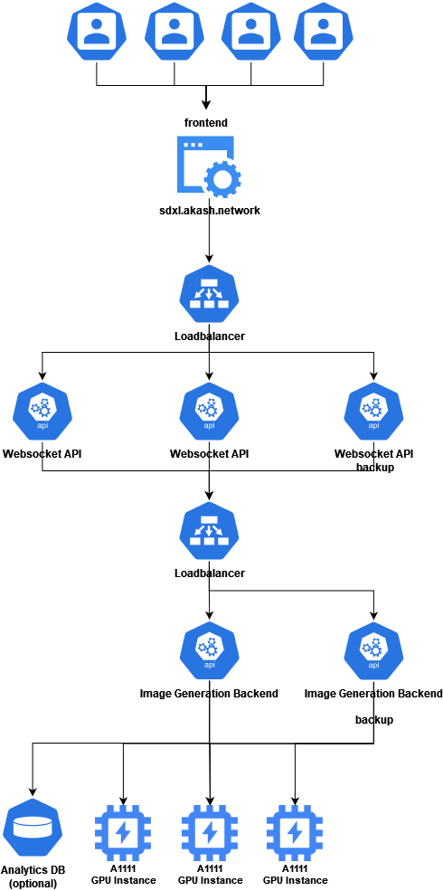
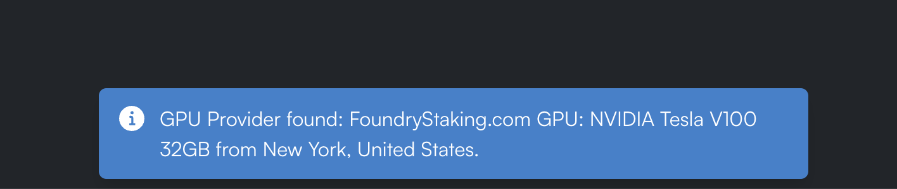

*Designing and developing a simple web application to demonstrate cost-effective inference of AI-generated images utilizing the Akash Supercloud.*

By [Zach Horn](https://twitter.com/zacharyhorn) and [Julius Haus](https://twitter.com/zJu_u)

In less than two years, AI diffusion models have improved exponentially. The models at the forefront of the space have developed from the ability to produce rough approximations of images based on an engineered text prompt to the capability of producing photo-realistic images from a natural language prompt as short as a few words. 

There are two main classes of models available today. The first class is closed-source proprietary models offered through consumer-facing inference applications with SaaS business models. This closed-source class includes apps like Midjourney and DALL-E (accessed through OpenAI’s ChatGPT interface). The second class is open-source models. These are often trained on proprietary datasets, but the resulting model weights are published for anyone to use and modify. This class includes models from StabilityAI, Meta, Runway, and others.

As many would expect, the first class of closed-source models has gained an edge in image quality. Midjourney’s v5.2 is currently regarded as the best model on the market in terms of overall subjective image quality. However, open-source models such as Stable Diffusion XL (SDXL) are rapidly gaining popularity and closing the gap in image quality.

Open-source models are not far behind. Stability AI released Stable Diffusion XL this past July, which can produce high-quality 1024x1024 images with comparable quality to Midjourney and DALL-E 3. However, unlike these models, SDXL is open-source.

Open-source is essential for enabling permissionless development. Akash has always been aligned with this principle — the network’s code and the [surrounding development community are both radically open](https://akash.network/blog/public-cloud-is-a-public-utility/).

To build SDXL on Akash, the team at [Overclock Labs](https://twitter.com/ovrclk_) set out to develop a simple web application to demonstrate the benefits of building with the Akash Supercloud. The development of SDXL on Akash was managed by [Zach Horn](https://twitter.com/zacharyhorn), with technical support from Andrey Arapov from Overclock Labs, and devloped by Akash Insider [Julius Haus](https://twitter.com/zJu_u).

The three objectives for SDXL on Akash:
1. Develop a simple yet performant web application to allow users to complete inference of SDXL.
2. Showcase GPUs on the Akash Supercloud from the highest-performance NVIDIA L40 and A100 to more cost-effective 40 and 30 series chips.
3. Serve as a zero-cost, permissionless touchpoint for Akash, allowing new users to interact with compute resources coordinated through Akash without the need to authenticate.


## The benefits of building on the Akash Supercloud
Akash provides several unique benefits that make the network well-suited to developing applications using open-source AI models running on heterogeneous compute.

**Access to high-performance GPUs**. Akash currently provides access to a wide range of GPU types. The network has been extensively tested across many of the most utilized NVIDIA GPU models. These include the L40, H100, A100, V100, A8000, A6000, 4090, 4080, 3090, 3080, and many more. 

**The ability to easily combine compute resources.** The power of Akash lies in its flexibility when mixing heterogeneous cloud resources across multiple deployments within a single application. We’ll touch on how this applies to the architecture of SDXL on Akash shortly.

**Flexibility in optimizing price and performance.** Akash's true power and performance shine through when extracting the most performance from a finite budget. Because of the network’s flexibility in terms of mixing resource types, it is possible to blend GPU types with different price and performance levels seamlessly. For example, SDXL on Akash has multiple instances deployed on NVIDIA A100 GPUs and RTX-3090s. If the user selects the A100 and 3090 options within the UI, the app will route to whichever GPU is available when the generation request is sent. A developer on a constrained resource budget could seamlessly allocate their resources in favor of lower-cost GPUs like the 3090 and deprioritize higher-cost (yet higher-performance) GPUs like the L40 or A100. Conversely, developers aiming for the highest possible performance and higher cost flexibility could weigh their deployments in favor of NVIDIA L40, H100, and A100 models. One of the most robust features of the network is the ability to architect the application in a way that provides complete control over the compute mix.

Below, we’ll cover how these benefits translate across the developer experience when building on Akash. First, we’ll briefly cover our thought process in choosing an open-source AI model.


## Development of SDXL on Akash
The idea to create the app that eventually became SDXL on Akash evolved as a collaboration between Overclock Labs and the Akash community. 

Our goal in creating [SDXL on Akash](https://sdxl.akash.network) was an easy-to-access, permissionless touchpoint for users to interact with Akash compute. Development began with work that Julius started during the Akash Mainnet 6 testnet. At that time, the initial version of the app could turn standard black-and-white QR codes into custom images styled according to a prompt but maintaining the functionality of the base QR code. In developing this AIQRArt, zJ became versed in Automatic1111 (A1111) — a Gradio-based web UI for working with diffusion models — and its API. With the launch of SDXL, which was released shortly after the [Akashathon](https://dorahacks.io/hackathon/167), we decided to pursue building and deploying this app on Akash.





The backend of SDXL on Akash is built with three layers. The top layer consists of a websocket server the user connects to from [sdxl.akash.network](https://sdxl.akash.network). This server validates the user's input and sends a POST request with the values required for image generation to the web server in the middle layer. To ensure that the A1111 instance is correctly configured, the settings are also updated in a previous step with the associated interface.

The middle layer consists of a manual load balancer written in Typescript and provides a redirect to the Rest-API of the A1111 instance via an Express webserver. The primary function of the load balancer is to prevent multiple user requests from queuing on a single instance, which would result in long wait times for completed generations.

The lowest layer consists of several A1111 instances with activated Rest-APIs deployed on multiple GPUs across several Akash providers. The current provider mix utilizes GPUs from Foundry Staking, Europlots, Akashost, and Overclock Labs. Across these providers, the app currently runs inference on NVIDIA L40, A100, V100, RTX-8000, and RTX-3090. Once deployed, these instances automatically install the SDXL base model and refiner and are ready to generate images immediately after startup.

As it is always possible for a server in the middle or lower levels to fail, an NGINX load balancer was added at the connection points between the top and middle layers and the middle and lower layers to forward traffic to redundant backup servers in case one of the primary servers fails. 

API requests that are routed to the A1111 Rest-API are formatted in this way:

```
{
"prompt": "prompt",
"negative_prompt": "negative_prompt",
"batch_size": 1,
"steps": 20,
"cfg_scale": 7,
"sampler_name": "DPM++ 2M Karras",
"width": 1024,
"height": 1024,
"refiner_checkpoint": "sd_xl_refiner_1.0.safetensors",
"refiner_switch_at": 0.8 // switch at total_steps*0.8
}
```

To develop the API request, we first updated the settings of the A1111 instance with a POST request to the /sdapi/v1/options endpoint. Because only some settings are relevant and some already contain values, they must be updated in the POST request. The most important settings are for the selected models "sd_model_checkpoint": "sd_xl_base_1.0.safetensors [31e35c80fc]", and "sd_checkpoints_limit": 2, so that the user can quickly switch to the refiner model. Every value can be set easily with a GET request to the /sdapi/v1/options endpoint. Once these settings are correctly configured, generating an image is as simple as sending these values to the  /sdapi/v1/txt2img endpoint with a POST request. Once the POST request is sent, you will get a Base64 encoded image ready to be processed and sent to the end user.

A1111 is currently one of the most user-friendly ways to generate images with open-source AI models. It offers many settings and extensions that allow anyone with a reasonably powerful GPU to create images. However, this ease of use comes with limitations that are particularly evident in the multi-stage creation of images (a technique becoming more popular with application developers and professional creatives). Multi-stage creation requires an interface allowing finer control over the generation process.

[ComfyUI](https://github.com/comfyanonymous/ComfyUI), a newer user interface rapidly gaining popularity, is well-suited to handle multi-stage image generation. The interface and API are significantly more flexible and perform better than A1111. It features a node-based UI where the user can set and connect many separate nodes, each of which handles a different aspect of the creation process. Initially, developing these multi-node functions can appear complex. Still, this process offers a more significant upside regarding flexibility in tailoring the final image output above and beyond what is possible in A1111.

To handle user input in a way that was ultimately scalable, we developed a simple frontend — hosted at [sdxl.akash.network](https://sdxl.akash.network) — to intake user input and display completed image generations. The website leverages React and is written entirely in Typescript. We also integrated components from [ChakraUI](https://chakra-ui.com/) to create a seamless, easy-to-use interface.

Depending on the GPU model, Most generated images only take a few seconds to complete. We wanted to show the user the inference time required for the generation to showcase the speed of the high-performance GPUs and the potential effectiveness of consumer-grade GPUs (which are slower for inference than their datacenter counterparts but often much less expensive). To accomplish this, we used a websocket server that connects bi-directionally to the website to reduce the number of HTTPS requests.

Deploying the entire app on Akash was seamless. It only required minimal prior knowledge of Docker and the [Stack Definition Language (SDL)](https://docs.akash.network/readme/stack-definition-language) — the native templating language for the Akash marketplace that allows users to detail the compute requirements for their deployment. Most importantly, the Akash Supercloud provided easy access to the wide range of GPU models needed to power the app. The Akash community had already created the required Docker images. Finally, we used environment variables to store sensitive data, such as access data for the LogDB.

## UI/UX Highlights
There are four primary ways we surface Akash compute through the user interface (UI) and user experience (UX) of SDXL on Akash.

**User access to GPU selection.** Users are given the option to toggle the GPU type that will run the inference. This allows users to experiment with compute from a range of NVIDIA GPUs, including the L40, A100, V100, RTX-8000, and RTX-3090. Each GPU provides a different level of performance at different prices. This allows users to understand the price-to-performance balance for their specific needs, whether that balance is weighted towards higher efficiency or more processing power for faster generation or higher-resolution images.

**A tailored set of inference options.** The application gives the user control of a selection of inference options to customize the generation process. By narrowing the scope of inference optionality from all possible options to only a few, the app remains easy to use while still providing a degree of image customization. The primary user input comes from the Prompt and Negative Prompt, which guide the model to produce an image with the keywords included in the prompt and remove aspects of the image based on keywords in the negative prompt. Upon opening the app, the user encounters the default prompt `futuristic city with neon lights, rainy streets, bright colors, detailed`, which gives new users a sense of the prompt structure that is optimal for inference. These prompts are typically short keywords or phrases separated by commas, and the negative prompt follows the same prompting syntax.

The 'Sampler Name' dropdown allows the users to choose from a selection of popular Stable Diffusion samplers (an algorithm that generates images by iteratively refining random noise into coherent visual content based on learned patterns). Each sampler can affect the output differently, so the user can experiment with each sampler to discover which works best to achieve their desired result. When loading the app, the sampler defaults to `DPM++ SDE Karras`. Although sampler preference can often be subjective, DPM++ SDE Karras offers a near-optimal mix of image quality and fast generation speeds at relatively low step counts (SDXL on Akash is hard-coded to run inference at 25 steps).

Lastly, the `Refiner Switch` presented with a slider, allows users to determine the point at which the refiner should take over in the image creation process. The diagram below shows the image production process in SDXL and how the refiner interacts with the base model to produce the final 1024x1024 image.


**Provider locations.** One of the most striking features of the Akash Supercloud is the global nature of the network. Akash currently features compute providers from around the world. In designing SDXL on Akash, we wanted to surface the provider name and location directly during image generation to showcase how seamlessly the network can distribute user requests to providers worldwide.



**Displays the total inference time for each generation.** The app also provides users with real-time feedback on the performance of its image generation process by displaying the inference time required to create each image. Surfacing performance metrics in the app allows users to gauge the performance of each GPU relative to each other. It is a benchmark for the application's performance (including the time required to generate the image on the GPU itself).

## The path forward for AI deployments on the Supercloud
The process of building SDXL on Akash demonstrates the power and flexibility of an open-source Supercloud to combine and optimize resources for building applications. The development process also shows how decentralized communities can collaborate to work on projects in a radically open manner — producing open-source code for public benefit along the way.

Any developers interested in building applications on Akash (both AI-focused and otherwise) can participate in open bounties that are offered to the entire community, including new developers who would like to join the Akash community. Currently available bounties can be [found on GitHub](https://github.com/akash-network/community).

SDXL on Akash is only the first of many AI deployments to come. As new applications for distributed Akash compute are realized, there will only be more opportunities to grow awareness of the potential of the Supercloud.