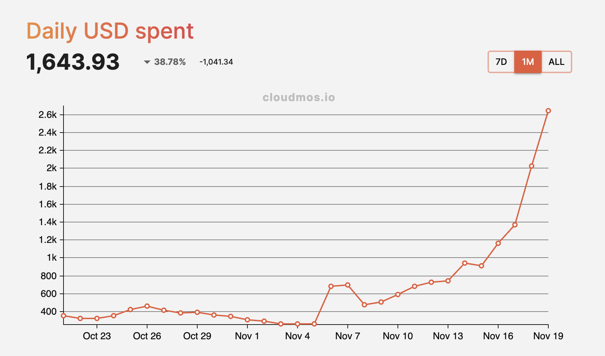
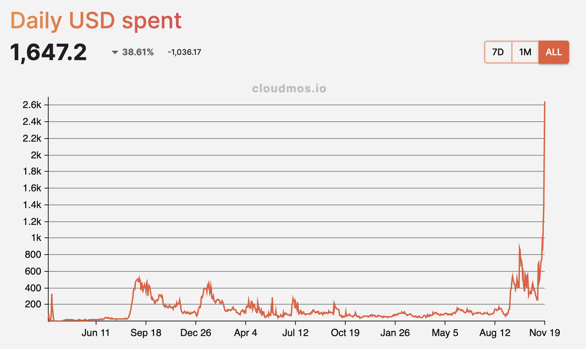

As the proliferation of Large Language Models (LLMs) and AI applications has come to a head, large corporations and agile startups are still struggling to secure access to high-performance GPUs. This is especially true for some of the largest corporations who have traditionally not had any trouble in ensuring compute to power their innovations––resulting in even tighter squeezes for access to compute resources. As such, developers are turning to alternative cloud networks like Akash to train and fine-tune their AI models.

This past Sunday, November 19th, Akash successfully completed the upgrade to Mainnet 8. This upgrade brought several quality-of-life improvements to the network, including increasing GPU visibility and giving providers more flexibility during the bidding process to streamline the deployment process — especially as [GPU utilization increases](https://deploy.cloudmos.io/graph/graphics-gpu) as network usage grows.

A brief overview of the core feature included with this upgrade, as outlined in [Akash’s Discussions on GitHub](https://github.com/orgs/akash-network/projects/5/views/1?pane=issue&itemId=41817276).

## Increasing GPU visibility
One of the most important ways to ensure adoption of the Akash Supercloud is to ensure that the deployment process is seamless and intuitive. Mainnet 8 lays the foundation for an improved deployment experience by enabling deployers to come to the network with a budget in mind and specify which  GPU attributes they’re seeking during the bidding process. 

Below is an example of a bid prior to the Mainnet 8 upgrade, which did not include GPU attributes. The lack of specific GPU model attributes made it difficult for deployers to have visibility into the types of resources they were receiving bids for during the provider selection stage of the bidding process, resulting in more information being surfaced at the right time to ensure deployers are satisfied with the resources provided and agreement made.

```
{
    "bid": {
        "bid_id": {
            "owner": "akash1...tkvk",
            "dseq": "12793097",
            "gseq": 1,
            "oseq": 1,
            "provider": "akash19p4t9d069nashxre9jg6j60cqlqkvtht6egpc9"
        },
        "state": "open",
        "price": {
            "denom": "uakt",
            "amount": "368.320765000000000000"
        },
        "created_at": "12793100"
    },
    "escrow_account": {
        "id": {
            "scope": "bid",
            "xid": "akash...tkvk/12793097/1/1/akash1...pc9"
        },
        "owner": "akash1...pc9",
        "state": "open",
        "balance": {
            "denom": "uakt",
            "amount": "5000000.000000000000000000"
        },
        "transferred": {
            "denom": "uakt",
            "amount": "0.000000000000000000"
        },
        "settled_at": "12793100",
        "depositor": "akash1...pc9",
        "funds": {
            "denom": "uakt",
            "amount": "0.000000000000000000"
        }
    }
}
```

Now, thanks to the Mainnet 8 upgrade, bids on the network include specific GPU model attributes, as shown below.

```
{
  "bid": {
    "bid_id": {
      "owner": "akash1ggk74pf9avxh3llu30yfhmr345h2yrpf7c2cdu",
      "dseq": "13759787",
      "gseq": 1,
      "oseq": 1,
      "provider": "akash17gqmzu0lnh2uclx9flm755arylrhgqy7udj3el"
    },
    "state": "closed",
    "price": {
      "denom": "uakt",
      "amount": "1432.735519000000000000"
    },
    "created_at": "13759790",
    "resources_offer": [
      {
        "resources": {
          "id": 1,
          "cpu": {
            "units": {
              "val": "1000"
            },
            "attributes": []
          },
          "memory": {
            "quantity": {
              "val": "1073741824"
            },
            "attributes": []
          },
          "storage": [
            {
              "name": "default",
              "quantity": {
                "val": "1073741824"
              },
              "attributes": []
            }
          ],
          "gpu": {
            "units": {
              "val": "1"
            },
            "attributes": [
              {
                "key": "vendor/nvidia/model/a100",
                "value": "true"
              }
            ]
          },
          "endpoints": [
            {
              "kind": "SHARED_HTTP",
              "sequence_number": 0
            }
          ]
        },
        "count": 1
      }
    ]
  },
  "escrow_account": {
    "id": {
      "scope": "bid",
      "xid": "akash1ggk74pf9avxh3llu30yfhmr345h2yrpf7c2cdu/13759787/1/1/akash17gqmzu0lnh2uclx9flm755arylrhgqy7udj3el"
    },
    "owner": "akash17gqmzu0lnh2uclx9flm755arylrhgqy7udj3el",
    "state": "closed",
    "balance": {
      "denom": "uakt",
      "amount": "0.000000000000000000"
    },
    "transferred": {
      "denom": "uakt",
      "amount": "0.000000000000000000"
    },
    "settled_at": "13759932",
    "depositor": "akash17gqmzu0lnh2uclx9flm755arylrhgqy7udj3el",
    "funds": {
      "denom": "uakt",
      "amount": "0.000000000000000000"
    }
  }
}
```

Focusing on the `resources_offer` section, we can see that the bid now includes a key and value that includes the GPU vendor and model, in this case, an NVIDIA A100 GPU. This will allow deployers to see which specific GPU models are being offered when a bid is received, along with allowing Akash deployment clients (such as Cloudmos Deploy) to surface the GPU model attributes in the deployment UIs. 

``` 
"attributes": [
    {
    "key": "vendor/nvidia/model/a100",
    "value": "true"
    }
]
```

The `resources_offer` details returned by the Akash Provider are particularly useful when a deployment is created with a list of acceptable GPU models. For example, a deployment may be created in which the tenant includes both NVIDIA A100 and H100 GPUs as acceptable and appropriate for the application. Previously, a tenant would not receive any details from the provider on what type of model was used in the bid response.

While either the A100 or H100 may be sufficient for the application, the deployer should be presented with the model used in the bid for more intelligent selection from amongst the list of bids. Now armed with the Resources Offer details, the deployer will know explicitly if the provider is including an A100 or H100 in the bid offer.

## Daily network revenue hits an all-time high
Since the launch of the GPU marketplace as part of the Mainnet 6 upgrade, network usage has been steadily climbing. As seen in the charts below, daily network revenue (measured here as daily USD spend, which is based on the underlying AKT spend on the network) is at an all-time high.

This is fueled in part by the start of the [Akash-Thumper AI foundation model training](https://github.com/orgs/akash-network/discussions/300) — marking the first time this has been done on a decentralized platform — and the continued growth of [SDXL on Akash](https://sdxl.akash.network), but also by increased adoption of the network by those looking for on-demand and high-performance compute.



The chart below shows daily network revenue since the network inception, which puts the current surge in usage in perspective.



## Get started with deploying on Akash
For more detailed technical information on the Mainnet 8 upgrade, head over to the [Akash Docs](https://docs.akash.network/akash-mainnet8-upgrade) to see the in-depth provider and node upgrade instructions, along with information to set up an Akash provider and deploy via the CLI.

For a user-friendly deployment app, head to [Cloudmos Deploy](https://deploy.cloudmos.io/) to see available network resources and to get started with a GPU deployment.