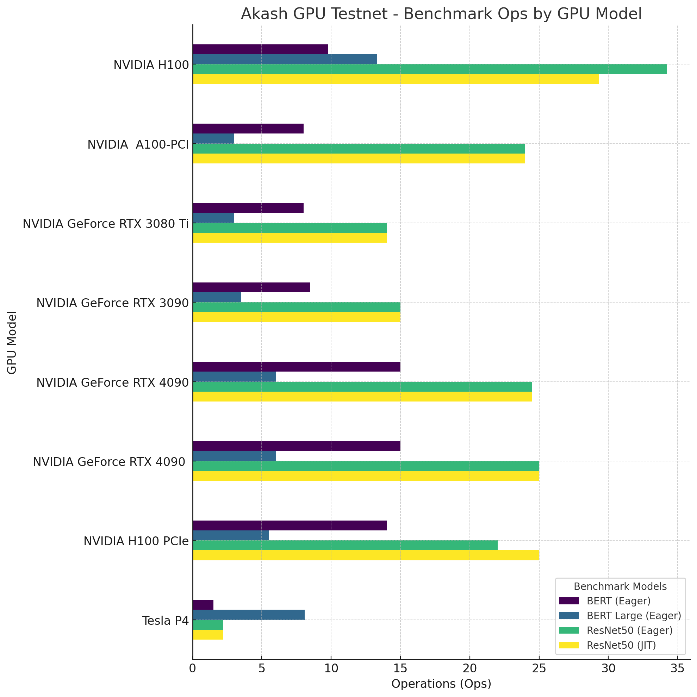

**Over 1,300 people from around the world signed up to participate in the Akash GPU Testnet.** This three-week public beta test was the first real-world demonstration of GPU compute being distributed with the open-source Akash Supercloud. The Supercloud concept was initially theorized by [Cornell University](http://supercloud.cs.cornell.edu/) and [MIT](https://supercloud.mit.edu/), before being practically applied in the [Akash Network whitepaper](https://akash-web-prod.s3.amazonaws.com/uploads/2020/03/akash-econ.pdf). The network has already developed a robust marketplace for cloud resources, and the addition of GPUs will allow the network to power the development of AI. Once GPU support is live following the Akash GPU Mainnet upgrade, the world will have access to an open marketplace for high-density GPUs available to everyone, from individuals to enterprises.

Let’s look back at the most important testnet highlights and the key contributors before looking ahead to the Akash GPU Mainnet upgrade.

## Key Achievements From the Akash GPU Testnet
Given the permissionless nature of Akash Network, the testnet was open to anyone around the world, and participants could interact with the new network features in any way they chose. To balance the widely open nature of the testnet with the need to validate the network for a specific set of criteria, Overclock Labs designed a controlled series of tasks that participants could complete to earn rewards. This ensured that the network was rigorously tested across a range of GPU types and AI model deployments and that the network would perform reliably after the upcoming mainnet upgrade.

The series of structured and incentivized tasks were divided into four main categories.

### Onboarding GPU Providers
Setting up GPU providers on Akash is one of the most important network features that will allow the AI Supercloud to become fully functional. One of the main goals of the testnet was to observe the provider setup process in a live production environment, identify and fix potential bugs or other issues, and receive feedback on the network’s UX from participants — who ranged from independent enthusiasts to highly experienced datacenter operators.

These were the key achievements from the GPU provider setup task:

- **A wide range of NVIDIA GPU models.** The testnet hosted GPUs from the highest-performing datacenter models (like the H100/A100) to widely-available consumer GPUs. The specific NVIDIA models that were incentivized for the testnet included: H100, A100, V100, P100, A40, A10, P4, K80, T4, 4090, 4080, 3090Ti, 3090, 3080Ti, 3080, 3060Ti.
- **High performance at both ends of the GPU range.** NVIDIA H100 and A100 models performed well on inference tasks for larger models and apps, while consumer-grade models in the 40-series and 30-series range performed well on compact models like [Falcon-7B](https://twitter.com/akashnet_/status/1668727064411635712?s=20).
- **Worldwide coverage.** Providers onboarded permissionlessly from around the world and successfully connected with deployers in many different countries worldwide.

### Deploying AI Workloads
Participants also deployed the leading open-source AI models on available GPU providers. This step was crucial to ensure that not only would high-parameter LLMs run efficiently on the highest-performance GPUs (like the NVIDIA H100 and A100) but also that smaller models would be able to be loaded onto consumer-grade hardware and still be able to perform well on inference tasks. Both of these tests passed successfully. 

The testnet hosted some of the most widely recognized AI models and apps, including Stable Diffusion, LLaMA, Flan-T5, RedPajama, Falcon, and many others. These models represent a selection of the most powerful and capable AI models available today. Ensuring they are able to run efficiently on the network provides a glimpse into future production use cases of the Akash Supercloud. The complete list of all AI models and apps with pre-configured deployment specifications (specifically for Akash Network) can be found in [the Awesome-Akash repo](https://github.com/akash-network/awesome-akash).

**High-level testnet deployment stats:**
- Total GPU deployment requests: 3,108
- Total amount of leases created (accepted bids): 2,463
- Total unique addresses that issued a GPU deployment request: 105
- Largest number of concurrently hosted GPUs: 80

The Overclock Labs team completed significant preparation before the launch of the testnet to ensure the basic deployment functionality worked as intended. The core of this work involved testing a selection of the leading AI models on NVIDIA H100 and A100 GPUs. An overview of this work, with screenshots of the individual deployments, can be found in this Twitter thread from Akash, which, as of today, has received more than 115,000 impressions.

Many participants also documented the process of deploying AI models on Akash GPU providers. Here are [examples](https://twitter.com/akashnet_/status/1677020245352132609?s=20) of people sharing their experiences and deployments on social media during the testnet.

- [Deploying TerminalGPT](https://twitter.com/RybnikovYuriy/status/1676698463214485505?s=20) — @RybnikovYuriy
- [Deploying Alpaca.cpp](http://RybnikovYuriy) — @RybnikovYuriy
- [Setting up an Akash Provider](https://twitter.com/foobar4423/status/1675056235144699904?s=20) — @foobar4423
- [Setting up an NVIDIA 3090 as a testnet provider](https://twitter.com/kaylem_nft/status/1674427595180638208?s=20) — @kaylem_nft
- [Building a sentiment analysis app on Akash](https://twitter.com/clydedev_/status/1676004100176072705?s=20) — @clydedev_
- [Step-by-step walkthrough of setting up an Akash GPU provider with a single k3 cluster](https://www.youtube.com/watch?v=0Kl9T_TEu7U)

The testnet also hosted [AIQRArt](https://twitter.com/akashnet_/status/1678862324801871872?s=20), built by [zJ (an Akash Insider)](https://twitter.com/zJu_u). AIQRArt is an easy-to-use application for creating custom QR images using a fine-tuned version of Stable Diffusion. It also features an easy sign-in process that allows users to connect to the app with an Akash wallet address without signing up with an email address or password.

### Creating Deployment Specifications (SDLs)
Akash deployments require a specification file created in an Akash-specific format called the [Stack Definition Language (SDL)](https://docs.akash.network/readme/stack-definition-language). One of the key testnet tasks involved participants creating these deployment specifications, each of which has to be tailored to the unique deployment (in this case, AI models and applications). 

The code below is an example of an SDL deployment file. 

```yaml
version: "2.0"

services:
  falcon7b:
    image: shimpa/falcon7b:0.07
    expose:
      - port: 8000
        as: 80
        to:
          - global: true

profiles:
  compute:
    falcon7b:
      resources:
        cpu:
          units: 8
        memory:
          size: 100Gi
        gpu:
          units: 1
          attributes:
            vendor:
              nvidia:
        storage:
          - size: 200Gi
  placement:
    akash:
      pricing:
        falcon7b: 
          denom: uakt
          amount: 100000

deployment:
  falcon7b:
    akash:
      profile: falcon7b
      count: 1
```

The Akash community maintains a repository of all the [currently available pre-created SDLs](https://github.com/akash-network/awesome-akash) called ‘Awesome-Akash.’ Currently, the repository contains 30+ categories and nearly 200 individual deployment specifications across a wide range of applications, AI models, and more. The entire repository and its files are fully open-source for anyone to reference and modify.

### Benchmarking GPU Performance
The final main task was specifically geared toward GPU Providers. This task required those who set up and ran GPU providers to run a PyTorch SDL to benchmark the performance of their GPUs on Akash. These early benchmarking deployments created a set of results that are visualized below. As part of Akash’s open-source ethos, the [entire dataset is publicly available for anyone to view and reference](https://docs.google.com/spreadsheets/d/1mkJOpmDqa0nY8llpCt0k0F7N0y8I9hgC_1X5LyYJw4g/edit?usp=sharing).

The process of benchmarking GPUs on Akash is ongoing and will be actively encouraged even after the launch of the Akash GPU Mainnet upgrade is complete. Public benchmarking will help to ensure that performance is transparent and open, especially as the network evolves.




## Looking Ahead
The successful completion of the testnet provides a strong indication that the features tested will ensure the success of the Akash GPU Mainnet upgrade, which will make the GPU features from the testnet available to everyone. The network is expected to complete the upgrade later this month. As of today, the code is complete, which only leaves a final round of testing before the upgrade proposal is put on-chain, which will allow the Akash community and the general public to vote on the upgrade. Once this proposal passes, the block height for the upgrade will be set, and the Akash core team will begin coordinating with validators to ensure a smooth upgrade on the specified date and time. 

Follow [Akash on Twitter](https://twitter.com/akashnet_) for real-time updates on the Akash GPU Mainnet upgrade, the network, and the community. Join the [Akash Discord](https://discord.akash.network) to connect with the community, participate in discussions, and contribute to the growing ecosystem.
