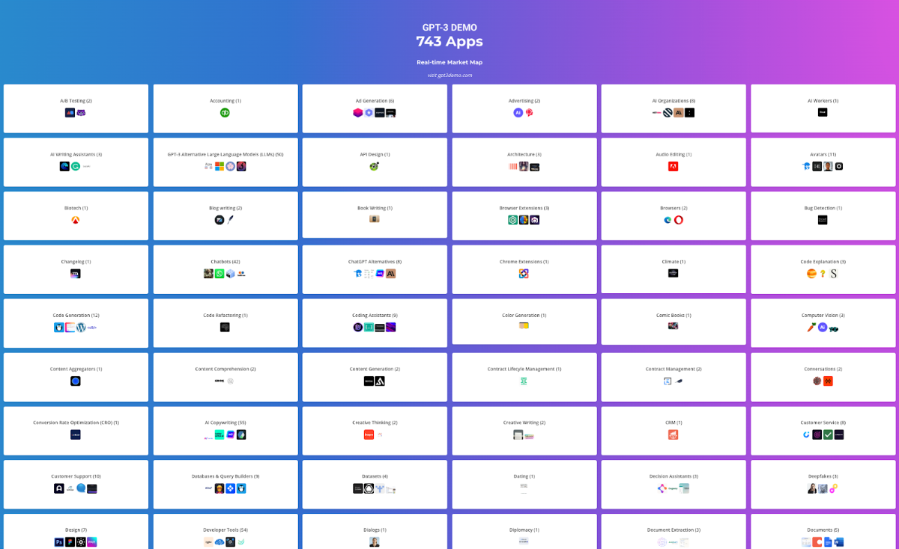
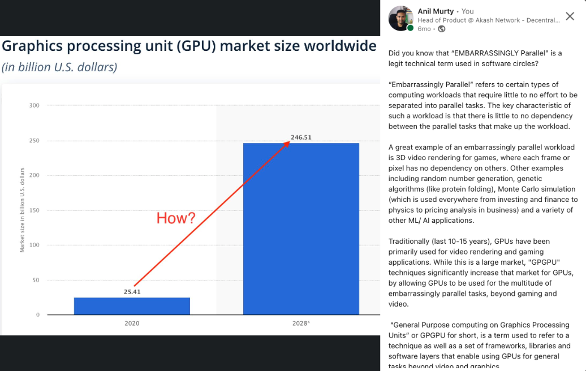
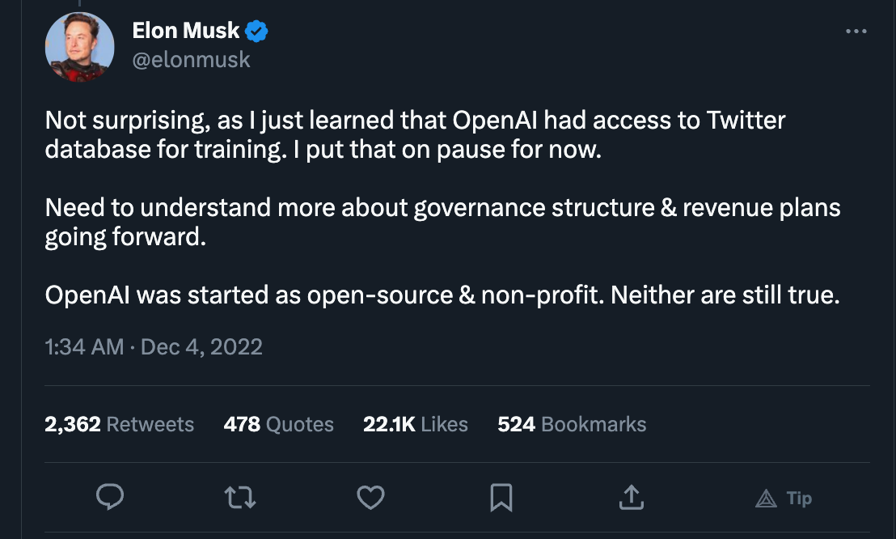
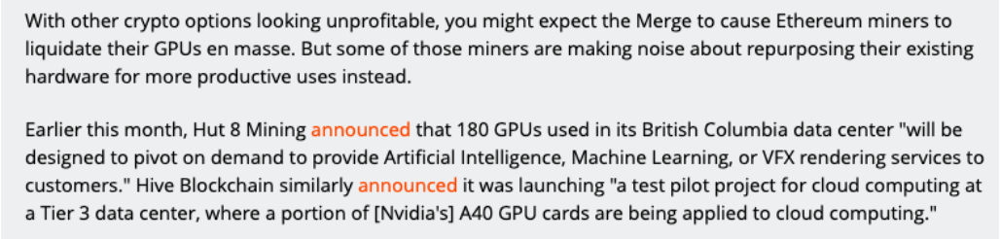
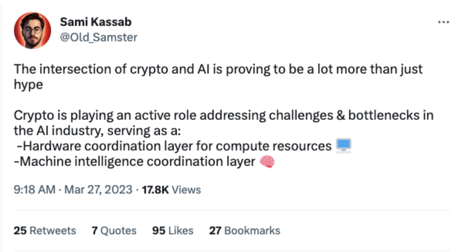
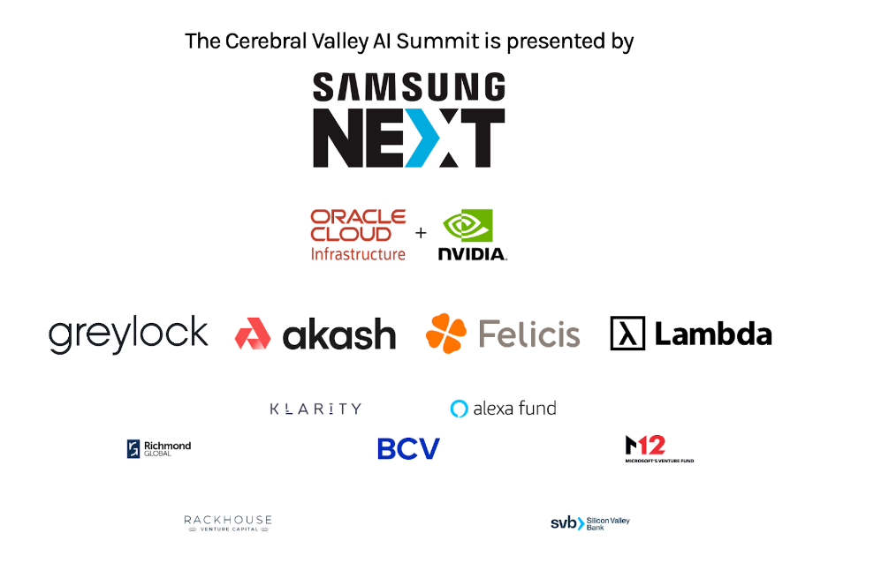

It’s barely 3 months into 2023 and it is clear that AI is going to dominate the tech space this year, and very likely this decade, by a wide margin (over Web3, Cloud, Mobile or anything else in the past couple decades). If you are in tech, you have to be living under a rock to not see that AI represents a generational shift in not just the way we will use products but also in the way all products are built and how businesses operate. As such, AI is opening new growth opportunities for all businesses, including those that I and the team & open source community I work with (at akash.network), are focused on (decentralized cloud computing).

Before starting to work on our AI offering (at [Akash Network](https://akash.network/)) I spent a fair amount of time educating myself about the AI landscape, starting around the time that ChatGPT got announced. And boy, have I had a lot of catching up to do for the last 6 months (and still struggle to keep pace with developments, each week)!

So, I figured I may save you some of the time I spent reading countless articles, blog posts, press releases, trying new products and building some prototypes myself, by sharing some high level learnings.

**Intended Audience**: This is not a beginners *“what is AI?”* post or an super advanced *“how does ControlNet modify the base stable diffusion model?”* or *“what are different types of tokenization methods?”*  type post, but somewhere in between. It is intended for people who have a general understanding of AI models and follow the “buzz” but are looking for a cohesive understanding of the players, use cases and high level model development process.

## New Generative AI Models every week
On average one new [Generative AI](https://en.wikipedia.org/wiki/Generative_artificial_intelligence) model was announced almost every week, thus far in 2023. Whether it be big announcements from [OpenAI](https://openai.com/), [Microsoft](https://www.microsoft.com/en-us/ai), [Google](https://ai.google/) and [Meta](https://ai.facebook.com/), or less “mainstream” models like [Stable Diffusion](https://en.wikipedia.org/wiki/Stable_Diffusion) (built through a collaboration between [CompVis](https://github.com/CompVis), [StabilityAI](https://stability.ai/) and [RunwayML](https://runwayml.com/)) or non mainstream products and models like [Midjourney](https://www.midjourney.com/), [ControlNet](https://github.com/lllyasviel/ControlNet), [Palm-E](https://palm-e.github.io/) or [Conformer-1](https://www.assemblyai.com/blog/conformer-1/). 

Some clear themes here:
1. There are multiple competing versions of everything. Whether it be the base model (for example: [DALL-E-2](https://openai.com/product/dall-e-2), [Dreambooth](https://github.com/google/dreambooth), [Stable Diffusion](https://stability.ai/), and [Midjourney](https://www.midjourney.com/home/?callbackUrl=%2Fapp%2F) are all competing for the “text-to-image” market, while Microsoft, Google and Notion are all competing for the “text analysis, suggestion, summarization…” market) or for services offered on top of a base model to make it easy to use (for example, both [StabilityAI](https://stability.ai/) and [RunwayML](https://runwayml.com/) are services built on top of the same open source stable diffusion model from [Compvis](https://github.com/CompVis/stable-diffusion))
2. For Text generation (and LLMs in general): GPT-4 from OpenAI is the undisputed king but Google’s [BERT](https://ai.googleblog.com/2018/11/open-sourcing-bert-state-of-art-pre.html), [PaLM](https://ai.googleblog.com/2022/04/pathways-language-model-palm-scaling-to.html) and Meta’s [LLaMA](https://ai.facebook.com/blog/large-language-model-llama-meta-ai/) are popular open source options.
3. The rise of AI chat applications: Led by the viral success of ChatGPT (created by OpenAI), new competitors are emerging to capitalize on the growing demand for LLM-powered chat tools. Notably, Anthropic’s [Claude](https://www.anthropic.com/index/introducing-claude), a highly customizable competitor to ChatGPT and Bing Chat.
4. For image generation: [Midjourney](https://www.midjourney.com/) seems to be in the lead for closed source models (even ahead of OpenAI’s [DALL-E](https://openai.com/product/dall-e-2)) and [Stable Diffusion](https://github.com/CompVis/stable-diffusion) is the most popular open source option. The contrast between the two is almost akin to the Apple/iOS and Android alternative.
5. [Huggingface](https://huggingface.co/) has become the defacto repository for AI/ML sharing and collaboration, aka the “Github for AI models and datasets.”

## Race to the bottom with “Open AI API wrapped” App clones

Outside of a few of the big tech companies (MS, Google, Meta) who have their own Generative AI models and LLMs, most of the AI productivity applications being built today (copy.ai, jasper.ai, playground.ai and countless others) are essentially wrappers on top of Open AI’s APIs. While they are seeing a lot of buzz, it is hard to imagine this continuing forever. While some of these will go on to generate 100s of millions of dollars in revenue, eventually this will be a race to the bottom for many of these startups and they will either consolidate or get acquired or just fade away. Most of the productivity AI applications will get integrated into existing bigger “traditional” applications (MSWord, GDocs, Slack, Teams, Salesforce, Hubspot, Notion, Adobe, Autodesk, VSCode, Replit, Github etc). 

The disruption to the above trend will only happen when one of the non-OpenAI models surpasses them in capabilities, efficiency, price and/ or functionality. This may happen from relatively unknown companies like Assembly.ai or from one of the big tech models (subsequent iterations/ generations of BERT, PaLM-E, LLaMA and others) or both.

Users may favor non-OpenAI models and services, if they prefer greater control as well. This definitely has similarities to the Apple (closed) + Android (open) ecosystem, both thriving alongside each other, in some ways.

And to be clear, there are some very valid and lucrative cases for both text analysis (in productivity apps like MS O365, GSuite, Notion and others) as well as for image generation (in Adobe, Autodesk, Canva and others). Here is a quick run down of the use cases for AI image generation:
1. **Avatar creation**: Applications like Avatar AI use text-to-image AI to generate custom avatars for users based on their textual descriptions of physical features, clothing, and accessories.
2. **Online shopping**: Some e-commerce websites use text-to-image AI to generate product images that show how items might look in different colors, styles, or settings based on user input.
3. **Gaming**: Video game developers use text-to-image AI to create game assets like characters, environments, and objects based on textual descriptions or scripts.
4. **Digital art**: Some artists use text-to-image AI to generate digital artwork based on written prompts, poetry, or other creative writing.
5. **Graphic design**: Text-to-image AI can be used by graphic designers to create custom graphics, logos, or illustrations based on textual descriptions of their clients' needs.
6. **Advertising**: Advertisers can use text-to-image AI to create compelling visual ads based on written ad copy or product descriptions.
7. **Virtual interior design**: Applications that generate realistic 3D environments based on textual descriptions can be used by interior designers or homeowners to visualize and plan room layouts and decor.
8. **Storytelling**: Writers or game developers can use text-to-image AI to generate visuals for their stories, games, or interactive narratives based on their written scripts or prompts.

If you are looking for more apps built on Open AI (and other models like Stable Diffusion) APIs, gpt3demo has a nicely sorted collection of more than 700 such apps, that seems fairly up to date.

## GPUs are the new oil (for tech)
GPUs from Nvidia have been in high-demand for several months now, with demand showing no signs of slowing. The challenge is sourcing GPUs (like [A100](https://www.nvidia.com/en-us/data-center/a100/) and [H100](https://www.nvidia.com/en-us/data-center/h100/)) that can allow these applications to run at a level of performance that doesn’t hurt user experience. This favors the big players who have either amassed a large inventory of GPUs or have the volume/ demand leverage to acquire them or are building their own tensor optimized hardware. It also puts Nvidia in a position of very strong leverage which it continues to try to cement by building it’s own cloud/ service layer ([Nvidia DGX Cloud](https://nvidianews.nvidia.com/news/nvidia-launches-dgx-cloud-giving-every-enterprise-instant-access-to-ai-supercomputer-from-a-browser)) that sits between the big clouds and Nvidia’s GPUs.

There are 4 things that will upset this equation:
1. **Alternatives to Nvidia Chips**: AMD, Intel & Xilinx are eager to take marketshare from Nvidia, after having underestimated or not planned for the potential of Generative AI.
2. **Big cloud leverage**: The big cloud players recognize the vulnerable position they’re in, with respect to Nvidia (who can dictate prices) and are making their custom silicon to reduce dependency (like Google TPUs and Amazon Graviton/ Inferentia/ Tranium). In addition, expect to see more partnerships between the big clouds and players in 1 above. 
3. **Software Optimizations**: Meanwhile, software optimizations that let models run on lighter hardware, continue to emerge. Best example of this is Neuralmagic’s Deepsparse technology (I’ve verified running BERT using this on a 2 Core vCPU and it works great) and ports of facebook’s LLaMA, like alpaca, that can be run on an M1 Mac or even a Raspberry Pi. 
4. **Distributed GPU compute solutions**: These have the potential to offer an alternative where a bunch of lower end GPUs (and GPU clusters) can be used in the absence of one higher end one. Some examples of this are companies working on GPU-over-IP type solutions. While these may not be applicable to some of the generative AI applications today, there are definitely use cases for them.

The key thing to keep in mind is that the GPU market was already predicted to explode by 10x, even before these new generative AI models were invented. [Here](https://www.linkedin.com/posts/anilmurty_parallelprogramming-gpu-cloud-activity-6984934072363995136-G5FB?utm_source=share&utm_medium=member_desktop) is a quick post I wrote 6 months ago, about what an “EMBARRASSINGLY PARALLEL” workload is and how it is the driving force behind the explosive growth of GPU usage, over the past decade.

## Open Source is alive and well in AI/ML

While the buzz around OpenAI (which to be clear is NOT open source, even though it originally started out that way) and its announcements overshadow everything else, it is becoming clear that Open Source isn’t dead in AI/ML.
1. All models released by Google (like [BERT](https://github.com/google-research/bert), [Dreambooth](https://github.com/google/dreambooth) and [PaLM](https://palm-e.github.io/)), Meta (LLaMa) and Compvision ([Stable Diffusion](https://github.com/CompVis/stable-diffusion)) are open source.
2. There are several efforts to building open source tooling, that makes it easier to run models, provides auxiliary services like “APIs for generating embeddings” and optimizes compute and memory requirements:
    * Cog: Is a tool for containerizing ML models from Replicate. Even though replicate is technically a competitor of sorts, they indicate that they have no problem in others using this on their own infrastructure. I’ve used this myself where I used this to containerize and run Stable Diffusion in GCP.
    * Chassis: Another product focused on making it easy to containerize ML Models + Data sets
    * Neural Magic’s technology that enables AI models to run efficiently on CPUs is open source: https://github.com/neuralmagic
    * There are independent Open Source developers implementing open source versions models almost as fast as the commercial companies do (even for some models from OpenAI): https://github.com/lucidrains?tab=repositories 
    * There are Open Source implementations for auxiliary functions, like “Embeddings-as-a-Service”: https://github.com/amansrivastava17/embedding-as-service 
    
    I’d love to hear from you if you have references to other open source projects for AI and ML.

3. It also remains to be seen, whether other internet platforms (particularly open ones, or ones trying to be more open, like twitter), decide to play nice with Open AI or not:

## AI Workload Types
To help understand the stages in AI model training and use, here is a quick and simplified view. After a base model (like [generic BERT](https://huggingface.co/google/bert_uncased_L-2_H-128_A-2) or [Base Stable Diffusion](https://huggingface.co/CompVis/stable-diffusion-v1-4)) has been developed (i.e. the model has been authored, neural network designed, implemented, data tokenized and trained with a base set of parameters), the following are the stages to using it in actual user applications :
* Step1: Hyperparameter Search or Tuning
  * **Goal**: Finding the right set of parameters (like “learning rate” or “neural network depth/ layers”) for the base model you chose and the application you are building. The output is the set of parameters that you will take to step 2
  * **Process**: Run a small training data set through multiple parameter combinations. Then pick parameters that result in the most accurate output (lowest loss). Can take from a couple hours to a couple days to do this per model, depending on how powerful the GPUs are.
  * **Other Considerations**: Each of these parameter combinations can be run in parallel and there is no communication necessary between the GPUs running them - i.e “Embarrassingly Parallel” problem. Therefore the HPC/ GPU cluster used for hyperparameter search does NOT require high bandwidth networking between the GPU servers.
  * **Infrastructure Requirements**: High End GPUs preferred (depending on how quickly you want the results and how many epochs/ runs you intend to perform). Availability and Uptime is nice-to-have but not mission critical (because this is not end user facing but just internal to the model/ app builder).
* Step2: Large-Scale Distributed Training
  * **Goal**: Training the model + parameters you have identified in Step1 so that it is ready to use in production (in an actual application) for inference (step 3)
  * **Process**: Typically will divide up the training data set into batches and train them in parallel (on the same model - the one you chose in step 1) so as to make it somewhat of an embarrassingly parallel problem.
  * **Other considerations**: There will be a lot of communication between the servers running these batches while the distributed training is happening (to feedback outputs of training runs to next run). So it is important to have a high speed communication between the GPU clusters/ providers.
  * **Infrastructure Requirements**: High End GPUs important to shorten training time. High bandwidth communication between GPU instances IS important. Availability and uptime again are nice to have but not mission critical.
* Step3: Production Inference
  * **Goal**: Deploy the model trained in step 2 in production (usually through a user facing product) and have it run predictions (infer things).
  * **Process**: Deploy the model you trained or pick a model trained by someone else and deploy it. This involves running the model and applying weights necessary to run predictions using the model.
  * **Other considerations**: In many cases, the users running production inference are not as sophisticated and technical when it comes to AI & ML as those building and training the models. User experience that abstracts infrastructure complexity is important to gain adoption with this user base.
  * **Infrastructure Requirements**: Can get by with less-than-best GPUs but availability and uptime are critical (since this will be a service used by external users)

## AI User Ecosystem
The ecosystem of products, companies and services that enable us to train, build and productize AI can be broken down as follows:
* ### Model & App Builders 
  This segment is further divided into 3 sub segments 
  * #### AI Model Creators: 
    These are scientific groups and companies that have the deepest knowledge and expertise in AI and ML and are engaged in building and training the models that power the applications. Popular models include, Stable Diffusion from CompVis, Google’s BERT, LaMDA & AudioLM, Open AI’s Whsiper, GPT and DALL-E,  Meta’s LLaMA, and more. In some cases, these companies and groups also produce the end-user application – as in the case of Google BARD and ChatGPT. In other cases the end user app is built by someone else – as in the case of Stable Diffusion or ControlNet. These users may be the authors of the model or initial (base) implementors or both. They are also running all 3 steps outlined in the previous section. In most cases, they will have access to their own infrastructure (and in many cases are a big cloud provider itself).
  * #### AI Model Tuners:
    These are users who take a base model and tweak it to improve it in some way to enable it to produce more accurate results. A good example of this is Stable Diffusion, which has two variants, one produced by StabilityAI and another produced by RunwayML. These users often don’t invent the model themselves but rather take a paper/ proposal and implement it or take an existing implementation and tune it for a specific type of application. These users are NOT inventing the model but usually must run through all 3 stages outlined in the previous section.
  * #### Pure App Developers: 
    There are a multitude of applications across various Enterprise and Consumer segments that are being built by companies of all sizes (startup to fortune 100). All these applications, rely on a handful of pretrained models (like the ones above) but serve the following categories
      * Text Summarization
      * Text-to-Speech conversion
      * Speech-to-Text conversion
      * Text Translation
      * Document Generation
      * Code Generation & Summarization
      * Image Generation & Editing
      * Video Generation & Editing
      * Audio Generation & Editing
      * Internet Search
    These users are typically only running the inference stage of the 3 stages outlined before, because they are taking a pre-trained and tuned model and building a nice user experience on it. They are typically just doing the inference portion of it. In a way, each time you use ChatGPT, you are using one such application that is running inference (aka, making a prediction about what text you are expecting when you ask it a question).
* AI Tool Builders: 
  These are teams and companies that are building tools to make it easy to discover, package and deploy AI models and in some cases offer these as services. Examples include, **Cog and Chassis** (for containerizing ML models), **Huggingface** (for discovering, sharing, reusing, models and ML datasets - essentially the github for AI/ ML), **Replicate** and **Banana.dev** (Deploying+Running AI models) as well as full cycle platforms for training, deploying and managing ML models - like **DataRobot**, **NeptuneAI** and **VertaAI**.
* AI Infrastructure Providers: 
  This is very core to all AI and ML development and advancement, regardless of what user segment or application is in question. This includes traditional public cloud providers, newer GPU focused providers (like Lamba Labs and Coreweave) as well as Traditional Datacenter and Cloud Hosting providers starting to offer GPUs. 

  [Akash Network](https://akash.network/) (that we are building, with a [small core team](https://ovrclk.com/) and [large open source community](https://github.com/akash-network/community)) is unique in this respect, in that it:
    1. Is Decentralized (we don’t own the infrastructure), in fact no one entity owns all of it.
    2. Is fully open source (all code on github: https://github.com/akash-network)
    3. Is open core and community driven: https://github.com/akash-network/community 
    4. Is Peer-to-Peer (in theory anyone with a server can become an Akash provider, but most are small or medium, datacenter operators).
    5. Has access to a large pool of GPU resources, thanks to availability of GPU power from a large crypto mining community that has relied on Akash for compute for years. Here is an excerpt from an [article published by arstechnica](https://arstechnica.com/gaming/2022/09/the-end-of-ethereum-mining-could-be-a-bonanza-for-gpu-shoppers/) last year, that talks about this:

	

Sami Kassab (analyst at Messari) has written extensively about this in his [latest report](https://messari.io/report/decentralizing-machine-learning?). 

Lastly, we will be sharing more about our AI plans at the Cerebral Valley AI Summit and would love to chat with you in-person if you are attending or in the area!

 

If you are interested in learning more about our offering, please sign up here [for early access](https://akt.fyi/3GiLw9F).